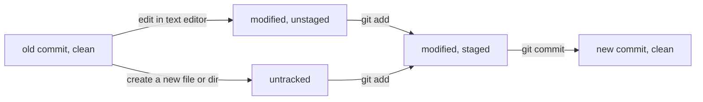
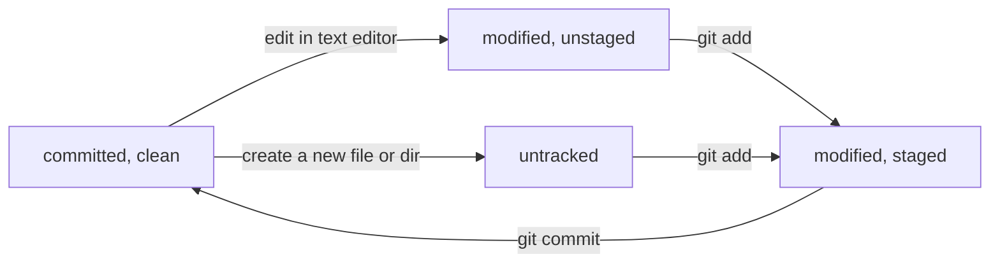

# Week 03a Notes
2026-01-20 Monday

## First Half

### Review from Last Time
* ZIP files to distribute code
	* You have to negotiate a different side channel to send the ZIP file (email, discord, etc.)
	* You have to negotiate or know who should make and send the ZIP file
	* if both of you have made changes, how to merge?
* Instead we use Git
* Describing strategy in English sentences
* Spawning baby rats

### The Four Git File Statuses

* Tracks changes in a top-level directory called a *repository*, or a repo.
* When you clone a repository locally, it's called a *working directory* and can have files in four different *statuses*
  * untracked
  * clean, committed (unmodified)
  * modified, staged
  * modified, unstaged
 
You can think of file statuses as being able to move forwards in stages towards a new "committed" status.



You can think of your "goal" in software development with Git is to eventually move all files into
the "clean, new commit" status at the end, which means if your computer were to lose power at
the moment, or your cat were to jump on your keyboard, you could reliably recover the state of
each file back to the last commit (after you restore power, or put your cat in another room).

In your local working directory, where you cloned `dgp-25au`, run the following command

```
git status
```

You can run this command any number of times and it doesn't change the repo.
It's called a *read-only* command.

You can also think of the development cycle of using Git as a circle, where the last and first
committed states are the same. We repeatedly move files through cycles like this if we changed and
develop code in them, or they stay the same if we don't edit code in them.



For *all* files in a repo, you can think about which of these three statuses each file is in,
and how you might move that file in between the statuses.

For example, when I run `git status` in my own repo I get

```
% git status
On branch main
Your branch is up to date with 'origin/main'.

Changes not staged for commit:
  (use "git add <file>..." to update what will be committed)
  (use "git restore <file>..." to discard changes in working directory)
        modified:   gradle.properties
        modified:   src/refplayer/RobotPlayer.java
        modified:   src/week01a/RobotPlayer.java

Untracked files:
  (use "git add <file>..." to include in what will be committed)
        ../.vscode/
        ../activities/BottleSong.class
        ../activities/BottleSong.java
        src/teacher02b/

no changes added to commit (use "git add" and/or "git commit -a")
```

What statuses is each file above in, and why?

## Break

## Second Half

### Random Movement of Baby Rats

* Describe how baby rats appear to be moving in lectureplayer
* Let's extract those lines of Java and enter them into our `week03a` player.

## State Machine for Baby Rats

Now, consider that baby rats can be in two "modes" or "states", which determine their action.
![[week-03-a-baby-rat-fsa.png]]
