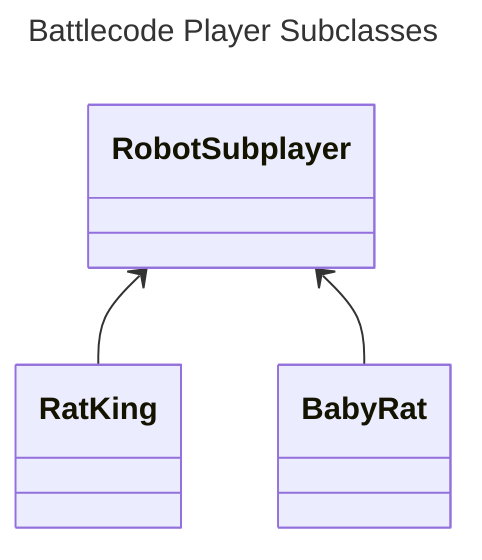

# Week 05a Notes
2025-02-03 Tuesday

## First Half

### Review
* We added `team` git remotes to our private forks
	* We practiced pushing and pulling to it
* We ZIP'd and uploaded our players to `play.battlecode.org`
	* And looked at examples of ranking
### Announcements
* Battlecode Final Tournament is over.
	* But you can still watch the match videos for ideas of strategies to borrow.
* Scrimmages appear disabled, so the reference player you must beat will be
	* `teacher08` whose source code we will be developing together in class
	* You are welcome to borrow source code from it, adapted to your own player

### Subclasses / Subplayers by Robot Type

## Break

## Second Half